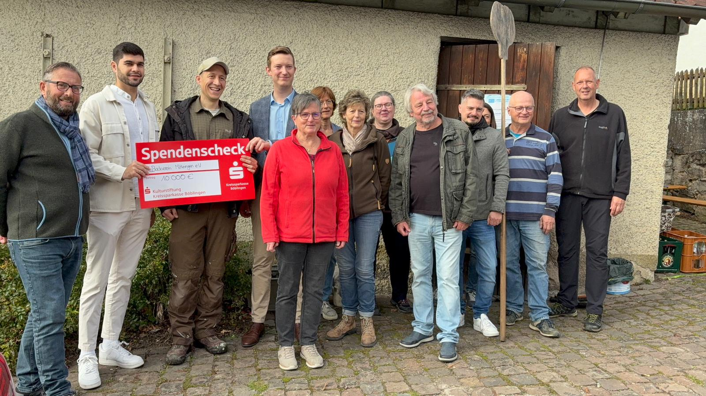

# Neuigkeiten

## 18.19.2025 Abschlussbacken im Backhaus
Zum Sanierungsauftakt des Backhauses in Mötzingen haben sich am Samstag 18.10.2025 rund 30 Mitglieder und Interessierte des Backverein Mötzingen getroffen um die anstehende Sanierung zu besprechen und gemeinsam Zwiebelkuchen und Brote zu backen und verkosten. In geselliger Runde konnte man sich über Rezepte austauschen und Interessantes über das Backhaus lernen. Wir planen noch in diesem Jahr mit der Sanierung beginnen zu können und freuen uns schon auf den neuen, traditionellen Steinofen und einen modernen, großen Elektroofen. Begleitet wurde unser Abschlussbacken von der Scheckübergabe der Kulturstiftung der Kreissparkasse Böblingen in Höhe von 10'000,00 €. Für diesen wichtigen finanziellen Beitrag möchte sich die Vorstandschaft in Namen aller Mitglieder bei der Kreissparkasse Böblingen bedanken.
  

## 21.08.2025 Zuwendungsbescheid vom Regierungspräsidium Karlsruhe
Der Backverein erhält den Zuwendungsbescheid für das Vorhaben "Erhalt des Backhauses in Mötzingen" und die damit verbundenen Fördermittel.

## 10.04.2025 Großzügige Spende der Kulturstiftung Kreissparkasse Böblingen
Der Backverein freut sich sehr über die großzügige Spende der [Kulturstiftung Kreissparkasse Böblingen](https://www.kskbb.de/de/home/ihre-sparkasse/stiftungen.html) in Höhe von 10'000,00 € für die Sanierung des Backhauses in Mötzingen.  

## 25.02.2025 Vorstellung im Gemeinderat
Vorstellung des Projektes "Erhalt des Backhauses in MötzingenProjekt-Nummer 03-1703-2-022" im Gemeinderat. Der Backverein freut sich über eine breite Unterstützung des Gemeinderats.

## 20.02.2025 Übertrag des Backhauses an Gemeinde Mötzingen
Übertragungsvertrag des Backhauses an Gemeinde Mötzingen durch einen Nachlassliquidator. Damit steht ein Eigentümer im Grundbuch und das Backhaus kann verpachtet werden. Vorgabe für LEADER Förderung.

## 11.02.2025 Einreichung des Förderantrags beim Regierungspräsidium Karlsruhe
Einreichung der Unterlagen für LEADER Förderung beim Regierungspräsidium Karlsruhe.

## 04.02.2025 Eintragung im Transparenzregister
Der Backverein Mötzingen e.V. wurde im Tranzparenzregister der Bundesrepublick Deutschland eingetragen.

## 16.01.2025 Ausstellung einer UD-Nummer
Der Backverein bekommt eine UD-Nummer vom Ministerium für Ernährung, Ländlichen Raum und Verbraucherschutz. Dies ist erforderlich für die LEADER Förderung.

## 08.01.2025 Eintragung im Vereinsregister
Der Backverein Mötzingen e.V. wurde im Vereinsregister des Amtsgerichts Stuttgart eingetragen.

## 17.12.2024 Nomminierung des Projektes durch LEADER Heckengäu
Der Projektantrag „03-1703-2-022 - Erhalt des Backhauses in Mötzingen“ wurde durch Beschluss des Auswahlgremiums für eine Förderung ausgewählt. Damit kann der Förderantrag beim Regierungspräsidium eingereicht werden.

## 13.11.2024 Auswahlsitzung LEADER im Landratsamt Böblingen
Der Backverein stellt im Landratsamt Böblingen in der Auswahlsitzung das Vorhaben "Erhalt des Backhauses in Mötzingen" vor.

## 11.11.2024 Überarbeitung der Satzung, Anerkennung der Gemeinnützigkeit
Mit der Überarbeitung der Satzung nach den Vorgaben des Finanzamtes Böblingen ist der Backverein Mötzingen e.V. offiziell gemeinnützig. "Bescheid über die gesonderte Feststellung der Einhaltung der satzungsgemäßigten Voraussetzungen nach §60a Abs. 1 AO"

## 23.09.2024 Gründung des Vereins
Der Backverein Mötzingen e.V. wurde im Bürgersaal der Gemeinde Mötzingen gegründet. Die neu gewählte Vorstandschaft hat sich sehr gefreut über die große Anzahl an Interessierten von insgesamt 35 Teilnehmern.

[Zum Artikel im Gäubote](https://www.schwarzwaelder-bote.de/inhalt.backhaus-in-moetzingen-verein-will-gebaeude-und-backkultur-beleben.ddc1af93-ea80-4773-9c49-2a30ebd21fad.html)

---
| [Startseite](index.md) | [Impressum](impressum.md) | 
